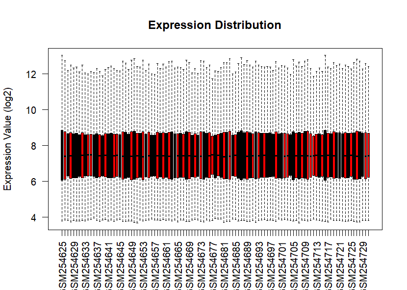
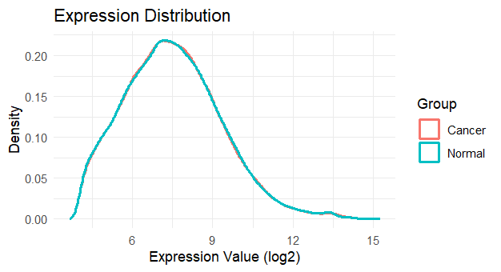
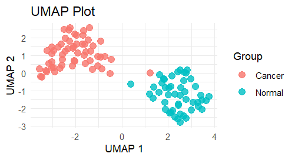
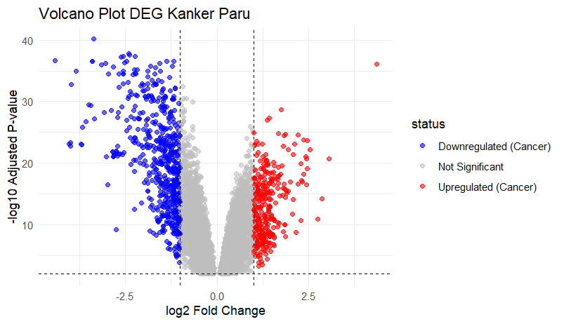
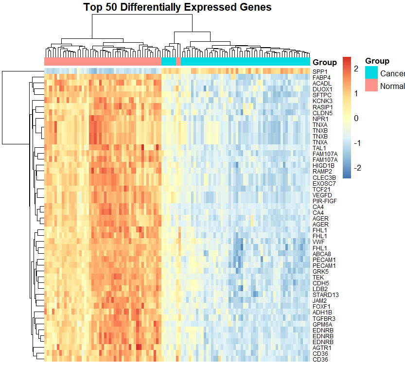
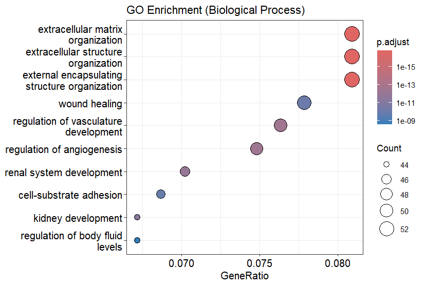
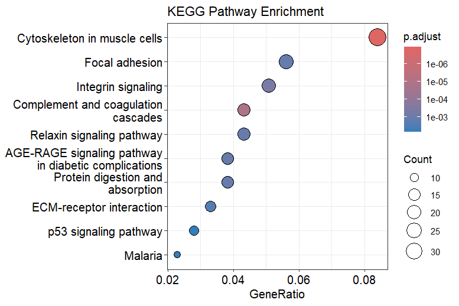

# Analisis Transkriptomik GSE10072  
### Differential Gene Expression dan Enrichment Pathway pada Adenokarsinoma Paru

---

## Deskripsi Proyek

Repositori ini berisi analisis data mikroarray dari dataset **GSE10072** yang diperoleh dari Gene Expression Omnibus (GEO). Dataset ini membandingkan jaringan paru normal dengan jaringan adenokarsinoma paru.

Tujuan analisis:

- Mengidentifikasi Differentially Expressed Genes (DEGs)
- Memvisualisasikan pola ekspresi gen
- Melakukan analisis Gene Ontology (GO)
- Melakukan analisis KEGG pathway
- Menyediakan pipeline analisis yang reproducible

---

## Informasi Dataset

- **GEO Accession:** GSE10072  
- **Platform:** Affymetrix Human Genome U133A (GPL96)  
- **Total sampel:** 107  
  - Adenokarsinoma paru: 58  
  - Jaringan paru normal: 49  

---

## Metodologi Analisis

Analisis dilakukan menggunakan **R (v4.5.2)** dengan paket:

- GEOquery  
- limma  
- ggplot2  
- pheatmap  
- umap  
- clusterProfiler  
- org.Hs.eg.db  
- hgu133a.db  

### Kriteria DEG

- |log2 Fold Change| > 1  
- Adjusted p-value (FDR) < 0.01  

---

## Ringkasan Hasil

- Total gen signifikan: **920**
- Upregulated pada kanker: **336**
- Downregulated pada kanker: **584**

### Proses Biologis Dominan (GO)

- Organisasi matriks ekstraseluler
- Regulasi angiogenesis
- Adhesi sel
- Regulasi perkembangan vaskular

### Jalur Signifikan (KEGG)

- Focal adhesion
- Integrin signaling pathway
- ECM-receptor interaction
- p53 signaling pathway

Hasil menunjukkan adanya perubahan signifikan pada organisasi matriks ekstraseluler dan jalur pensinyalan sel dalam adenokarsinoma paru.

---

# Visualisasi

## 1. Distribusi Ekspresi (Boxplot)


## 2. Density Plot


## 3. UMAP Clustering


## 4. Volcano Plot


## 5. Heatmap Top 50 DEG


## 6. GO Enrichment


## 7. KEGG Enrichment


---


---

## Requirements

- R ≥ 4.5.2  
- RStudio (direkomendasikan)

### Instalasi Paket

```r
install.packages(c("ggplot2", "dplyr", "pheatmap", "umap"))
BiocManager::install(c(
  "GEOquery",
  "limma",
  "clusterProfiler",
  "org.Hs.eg.db",
  "hgu133a.db"
))
